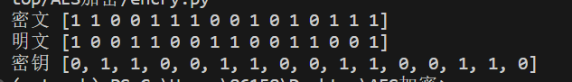

# 信息安全课程作业
这是一个简单的AES加密的实现，包括加解密并实现简单的图形化
明密文、密钥均为16bit的二进制或两字节的字符，并在此基础上进行拓展：包括两重加密、三重加密、中间相遇攻击、CBC加密长消息等等

小组名称：Sigma-men

## 内容介绍
### 背景介绍
AES（Advanced Encryption Standard）是一种对称加密算法，也被称为Rijndael算法。它是目前广泛应用的加密标准之一。

AES算法使用相同的密钥进行加密和解密操作，这意味着发送方和接收方必须共享相同的密钥。AES算法支持多种密钥长度，包括128位、192位和256位。较长的密钥长度通常提供更高的安全性，但也会增加计算成本。

AES算法基于替代和置换的操作，通过多轮的迭代来处理数据块。它将输入数据分为固定大小的块，每个块的大小为128位。然后，算法将数据块应用于一系列的转换，包括字节替代、行移位、列混淆和轮密钥加等步骤。

在字节替代步骤中，算法使用一个固定的S盒（Substitution Box）来将每个字节替换为另一个字节，从而增加混淆度。行移位步骤将每一行向左循环移动不同的次数。列混淆步骤通过使用固定的矩阵变换来改变每一列的值。轮密钥加步骤将当前轮的密钥与数据块进行异或运算，以增加安全性。

### 算法介绍
如下图所示，一个及那话版的AES加密的主要步骤为：


接下来笔者进行简单的介绍。
#### 密钥处理
密钥为16bit，将被分为两个8bit，为w0、w1   
  
按照上图所示依次解出w2、w3、w4、w5
1. RCON[i]是一个轮常数，RCON[1]=x^3=100，RCON[2]=x^4mod(x^4+x+1)=x+1=0011，右半字节补0。所以，RCON[1]=10000000，RCON[2]=00110000

2. +号为异或运算，SubNib则为s盒置换，RotNib为交换左右4个bit，g(w)运算如下图所示


3. 最后使用的密钥key1=key,key2=w2+w3,key3=w4+w5
   
#### 加密
##### 第1轮
1. 首先把传入的明文轮密钥加，即将明文和密钥进行异或运算(此时是把明文与key1进行异或运算)

2. 随后进行半字节替代，即从第一个bit开始，每4个bit(设为abcd)作为一个单位，并且把每个单位放入s盒中进行置换，置换的元素的s盒的第ab行、cd列的元素

3. 随后进行行移位，即可认为把第二个单位和第四的单位交换位置

4. 下一步是进行列混淆，可以认为是矩阵运算，如下图所示，选择一个对称矩阵，和它进行矩阵乘法，而加法则可以认为是异或，而乘法为GF(2^4)上的乘法，具体细节可以看后面的数据


5. 下一步则是进行第二次轮密钥加，即将上一步的结果和key2进行异或运算

##### 第2轮
1. 接下来进行再次进行半字节替代

2. 随后进行行移位，即将第2个单位和第4个单位进行交换

3. 下一步是第三次轮密钥加，把上一步的结果和key3进行异或运算，最后就可以得到密文

#### 解密
相较于加密来说，解密则是其逆向的过程，代入子密钥的顺序则是相反的
##### 第1轮
1. 首先将密文与key1进行异或

2. 对上一步的结果进行逆行移位，和行移位相同，同样是把第2个单位和第4个单位进行位置互换

3. 下一步是逆半字节替代，方法和半字节替代相同，但是需要使用逆s盒

4. 然后再次进行轮密钥加，即将上一步的结果和key2异或

5. 然后进行逆列混淆，需要选择一个和列混淆矩阵相乘后为单位阵的矩阵

##### 第2轮
1. 将上一步结果进行逆行移位

2. 将上一步结果进行逆字节替代，和第1轮相同

3. 将上一步结果与key1进行异或，则得到明文

### 代码使用的数据
1. s盒与逆s盒
   


1. 列混淆矩阵与逆列混淆矩阵
   


1. 乘法运算

](pictures/image-1.png)

## 运行环境
python3.11.5

numpy 1.26.0 

tk 8.6.12
## 关卡测试
### 第1关：基本测试
根据S-AES算法编写和调试程序，提供GUI解密支持用户交互。输入可以是16bit的数据和16bit的密钥，输出是16bit的密文。

如下图所示，可以实现正常的加解密，并且经过手动验算，结果正确
](pictures/image-2.png)
](pictures/image-3.png)
](pictures/image-4.png)


### 第2关：交叉测试
考虑到是"算法标准"，所有人在编写程序的时候需要使用相同算法流程和转换单元(替换盒、列混淆矩阵等)，以保证算法和程序在异构的系统或平台上都可以正常运行。设有A和B两组位同学(选择相同的密钥K)；则A、B组同学编写的程序对明文P进行加密得到相同的密文C；或者B组同学接收到A组程序加密的密文C，使用B组程序进行解密可得到与A相同的P。

如图所示，和陈鹏帆同学小组的加解密结果是一致的，


再换成其他的明密文、密钥进行尝试,如下图所示，加密结果是一致的



### 第3关：扩展功能
考虑到向实用性扩展，加密算法的数据输入可以是ASII编码字符串(分组为2 Bytes)，对应地输出也可以是ACII字符串(很可能是乱码)。

主要考虑传进加密运算时先转化为ASCii值，然后转化为二进制的；而输出时则相反，把二进制bit转化为10进制的值，随后再转化为对应ASCii字符

如图，当明密文、密钥中存在输入字符时，则输出的结果也是字符


### 第4关：多重加密
#### 双重加密
将S-AES算法通过双重加密进行扩展，分组长度仍然是16 bits，但密钥长度为32 bits

双重加密时使用的密钥为32bit，那么则可以通过两次简单的加密，得到密文，再类似的，通过两次解密得到明文，双重加密示例代码如下

```python
def double_encrypt(plaintext,key):
    K2=key[16:]
    first_ciphertext=encrypt(plaintext,key)
    ciphertext=encrypt(first_ciphertext,K2)

    return ciphertext

```
如下图所示，明密文仍为16bit，而密钥为32bit，可以实现正常的加解密


#### 中间相遇攻击
假设你找到了使用相同密钥的明、密文对(一个或多个)，请尝试使用中间相遇攻击的方法找到正确的密钥Key(K1+K2)。

中间相遇攻击（Meet-in-the-middle Attack）是一种密码学攻击方式，它利用密码算法的可逆性和其输入输出空间的大小，通过两次计算，找到符合特定条件的密钥或明文。该攻击通常用于破解对称密钥加密算法，如AES等。

中间相遇攻击需要进行以下步骤：

1. 预处理：首先，攻击者会对明文空间进行遍历，将结果存储在一个表格中，即预处理过程。这个表格包含了所有可能的明文与密钥组合的加密结果。

2. 后处理：接下来，攻击者会对密文空间进行遍历，同样将结果存储在一个表格中，即后处理过程。这个表格包含了所有可能的密文与密钥组合的解密结果。

3. 匹配：攻击者会查找两个表格中相同的加密结果或解密结果，从而得到相应的密钥或明文。

因此可先使用两个明文加密得到密文，并且获取中间结果输出，从而设法得到密钥
```python
# 示例使用
key1=[1,1,1,1,1,1,1,1,1,1,1,1,1,1,1,1]
plaintext1 = [1,1,1,1,1,1,1,1,1,1,1,1,1,1,1,1] # 明文1
ciphertext1 = encrypt(plaintext1, key1)  # 密文1
ciphertext1=[int(bit) for bit in ciphertext1]
plaintext2 = [0,0,0,0,0,0,0,0,0,0,0,0,0,0,0,0] # 明文2
ciphertext2 = encrypt(plaintext2, key1)  # 密文2
ciphertext2=[int(bit) for bit in ciphertext2]

key = find_key(plaintext1, ciphertext1, plaintext2, ciphertext2)
print("Correct key:", key)
```

尝试得到密钥
```py
def find_key(plaintext1, ciphertext1, plaintext2, ciphertext2):
    # 使用中间相遇攻击找到正确的密钥
    
    # 遍历所有可能的密钥
    for key in range(65536):
        key_binary = bin(key)[2:].zfill(16)  # 将密钥转换为16位二进制表示
        key_binary=[int(bit) for bit in key_binary]
        
        # 加密明文1和明文2，获取中间计算结果
        intermediate_results1 = get_intermediate_results(plaintext1, key_binary)
        intermediate_results2 = get_intermediate_results(plaintext2, key_binary)
        
        # 判断中间计算结果是否相等
        if np.array_equal(intermediate_results1, intermediate_results2):
            # 对两个轮密钥的异或结果进行异或运算，得到正确的密钥
            correct_key = xor(intermediate_results1, intermediate_results2)
            return correct_key
    return None
```
获取密钥如下，与使用的加密密钥相同


#### 三重加密
将S-AES算法通过三重加密进行扩展，下面两种模式选择一种完成：

(1)按照32 bits密钥Key(K1+K2)的模式进行三重加密解密，

(2)使用48bits(K1+K2+K3)的模式进行三重加解密。

采用48bit密钥进行三重加密，则相当于使用K1、K2、K3各加密一次，经过三重加密获得明文，而密文则过程相反，简单的示例代码如下

```py
def triple_encrypt(plaintext,key):
    K1=key[:16]
    K2=key[16:32]
    K3=key[32:]
    first_ciphertext=encrypt(plaintext,K1)
    second_ciphertext=encrypt(first_ciphertext,K2)
    ciphertext=encrypt(second_ciphertext,K3)
    
    return ciphertext
```

如下图示例，使用48位的密钥进行三重加解密


### 第5关：工作模式
基于S-AES算法，使用密码分组链(CBC)模式对较长的明文消息进行加密。注意初始向量(16 bits) 的生成，并需要加解密双方共享。在CBC模式下进行加密，并尝试对密文分组进行替换或修改，然后进行解密，请对比篡改密文前后的解密结果。

#### CBC
通过AES的特定工作模式可以实现对长消息的加密，比如CBC，如下图所示

CBC中包括待加密的明文、密钥、以及双方共有的一个初始向量，加密流程如下

1. 将明文划分为每个nbit明文块(P1-Pn)进行加密
2. 将初始向量与P1进行异或，然后将得到的结果和key进行加密得到密文块C1
3. 将C2与P2进行异或，然后将得到的结果和key进行加密得到密文块C2
4. 依次类推得到C1-Cn
5. 解密则同理，把密文C1-Cn，从头开始解密，将C1与key进行解密，然后与初始向量异或得到明文块P1
6. 而把C2与key进行解密后，与C1进行异或则得到明文块P2，依次类推即可


示例加解密代码如下
```py
# CBC加密
def cbc_encrypt(plaintext, i_v, key):
    plaintext1, plaintext2, plaintext3, plaintext4 = text_cut(plaintext)  # 切割
    K1 = xor(plaintext1, i_v)  
    C1 = encry.encrypt(K1, key)  #
    # 以此类推
    K2 = xor(plaintext2, C1)
    C2 = encry.encrypt(K2, key)
    K3 = xor(plaintext3, C2)
    C3 = encry.encrypt(K3, key)
    K4 = xor(plaintext4, C3)
    C4=encry.encrypt(K4, key)
    
    ciphertext = np.concatenate((C1, C2, C3, C4))

    return ciphertext

```

```py
# CBC解密
def cbc_decrypt(ciphertext, i_v, key):
    ciphertext1, ciphertext2, ciphertext3, ciphertext4 = text_cut(ciphertext)  # 解密按照相同顺序一段一段解密就好
    k1 = encry.decrypt(ciphertext1, key)
    plaintext1 = xor(i_v, k1)
    k2 = encry.decrypt(ciphertext2, key)
    plaintext2 = xor(ciphertext1, k2)
    k3 = encry.decrypt(ciphertext3, key)
    plaintext3 = xor(ciphertext2, k3)
    k4 = encry.decrypt(ciphertext4, key)
    plaintext4 = xor(ciphertext3, k4)
    
    plaintext = np.concatenate((plaintext1, plaintext2, plaintext3, plaintext4))

    return plaintext

```
下面是示例明密文、密钥以及初始向量
```py

if __name__ == "__main__":
    ciphertext = [1, 0, 0, 0, 1, 0, 1, 0, 0, 0, 1, 1, 1, 1, 1, 1,
                  0, 0, 1, 1, 1, 0, 0, 1, 0, 0, 1, 1, 1, 1, 1, 1,
                  1, 0, 1, 0, 1, 0, 0, 0, 0, 1, 1, 1, 1, 0, 0, 0,
                  0, 0, 1, 0, 0, 0, 1, 0, 0, 0, 0, 1, 1, 1, 1, 1]  # 示例密文
    plaintext = [1, 0, 1, 0, 1, 0, 1, 0, 1, 0, 1, 0, 1, 0, 1, 0,
                  1, 0, 1, 0, 1, 0, 1, 0, 1, 0, 1, 0, 1, 0, 1, 0,
                  1, 0, 1, 0, 1, 0, 1, 0, 1, 0, 1, 0, 1, 0, 1, 0,
                  1, 0, 1, 0, 1, 0, 1, 0, 1, 0, 1, 0, 1, 0, 1, 0]  # 示例明文
    
    key = [0, 0, 1, 0, 1, 1, 0, 1, 0, 1, 0, 1, 0, 1, 0, 1]  # 示例密钥
    i_v = [1, 0, 0, 1, 1, 0, 0, 1, 1, 0, 0, 1, 1, 0, 0, 1]  # 初始向量

    ciphertext1 = cbc_encrypt(plaintext, i_v, key)
    plaintext1 = cbc_decrypt(ciphertext, i_v, key)

    print(ciphertext1)
    print(plaintext1)
```

输出如下所示，能够实现正常的加解密


下面更改密文，把第一个bit更改，然后再次运行，查看解密结果，可以看到解密出的明文改变了


#### CFB
我们再尝试使用CFB工作模式进行加解密，CFB与CBC相似，主要区别是CFB是让初始向量与key进行加密后与明文块异或得到密文块，而将本次得到的密文块作为下一步的初始向量，依次类推得到所有的密文块


代码示例如下
```python
#CFB加密
def cbc_encrypt(plaintext,i_v,key):
    plaintext1,plaintext2,plaintext3,plaintext4=text_cut(plaintext)#切割
    k1=encry.encrypt(i_v,key)#初始向量和密钥加密得到k1
    ciphertext1=xor(plaintext1,k1)#异或得到第一段加密文，并作为下一段的向量
    #以此类推
    k2=encry.encrypt(ciphertext1,key)
    ciphertext2=xor(plaintext2,k2)

    k3=encry.encrypt(ciphertext2,key)
    ciphertext3=xor(plaintext3,k3)

    k4=encry.encrypt(ciphertext3,key)
    ciphertext4=xor(plaintext4,k4)

    ciphertext=np.concatenate((ciphertext1,ciphertext2,ciphertext3,ciphertext4))


    return ciphertext

#CFB解密
def cbc_decrypt(ciphertext,i_v,key):
    ciphertext1,ciphertext2,ciphertext3,ciphertext4=text_cut(ciphertext)#解密安装相同顺序一段一段解就好
    k1=encry.decrypt(i_v,key)
    plaintext1=xor(ciphertext1,k1)

    k2=encry.decrypt(plaintext1,key)
    plaintext2=xor(ciphertext2,k2)

    k3=encry.decrypt(plaintext2,key)
    plaintext3=xor(ciphertext3,k3)

    k4=encry.decrypt(plaintext3,key)
    plaintext4=xor(ciphertext4,k4)

    ciphertext=np.concatenate((plaintext1,plaintext2,plaintext3,plaintext4))


    return plaintext
```
输出结果如下，实现长消息的加解密


感谢老师的指导与组员的辛勤工作！

指导老师：陈欣
